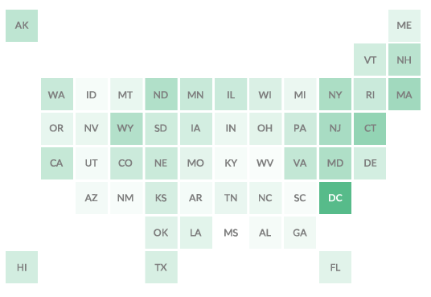

# SimpleTileMaps
This is repository of a few tools for making very simple tiles maps including gradients, no coding required.

Recently I had become interesting in making Tile Maps of the United States for the purposes of displaying data. Tile maps are have recently become quite popular within the data because they make data easily recognizable when organized by state and fix some of the more confusing aspects of data geographically accurate maps. The NPR Visuals team did a good [blog post about Tile Maps](http://blog.apps.npr.org/2015/05/11/hex-tile-maps.html) which I highly recommend (though I am not a fan of their Hexagon tiles).

In figuring out how I would make Tile Maps I knew I wanted it to have a few aspects:

###Work with the Tools You Know
A lot of the data visual world has moved towards various ways of using code (like [D3.js](http://d3js.org/)) to generated the visuals for a given set of data. Code is great, but I like many other people am a novice so I wanted to keep to the tools I knew and hopefully even learn new ways to use them.

You can make the tile maps with nothing but a Text Editor (try [Atom](https://atom.io/)), Google Docs, and a SVG editor like [Inkscape](https://inkscape.org/en/) or Illustrator.

###Make it a Simple Process
I wanted my method of making Tile Maps to be dead simple. Nothing involved in my process requires anything more than knowing how to copy, paste, and delete.

#How to Make a Tile Map
